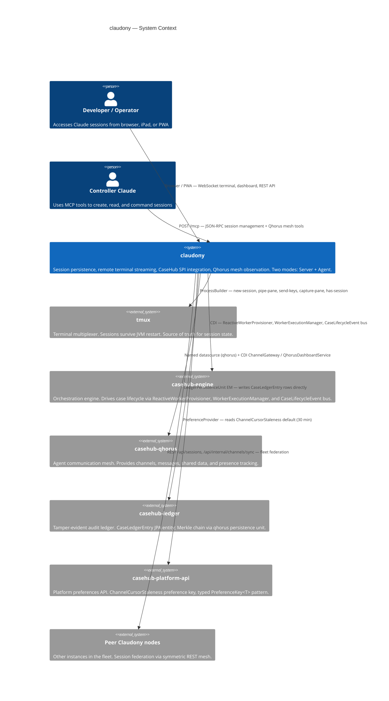
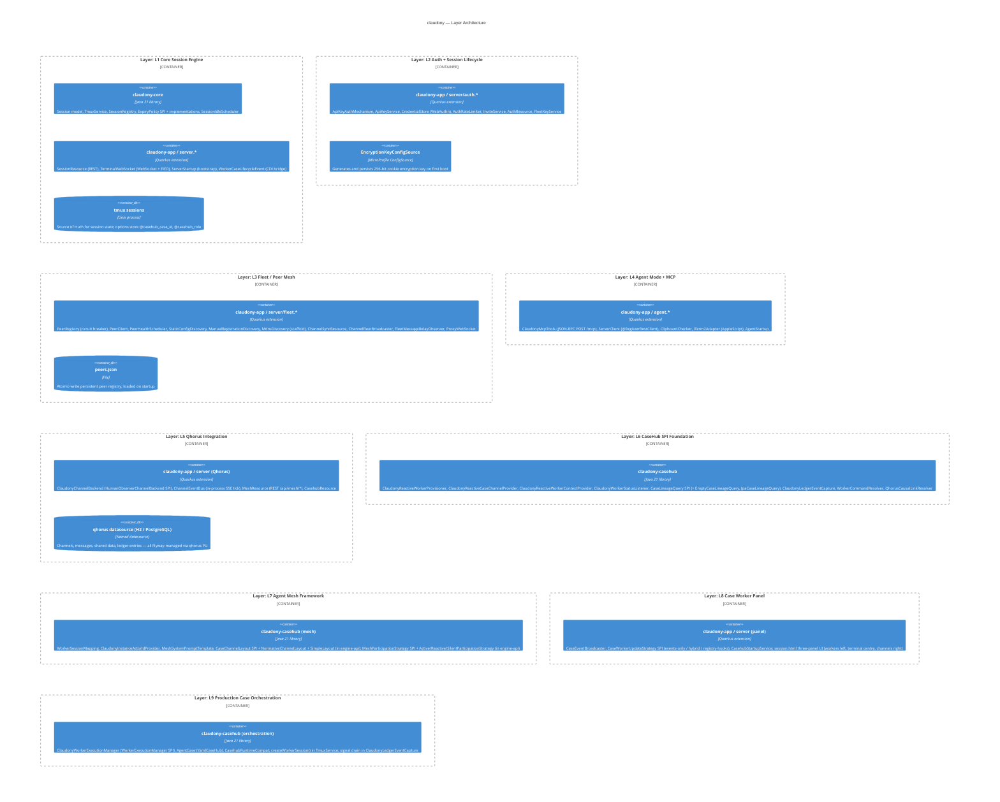
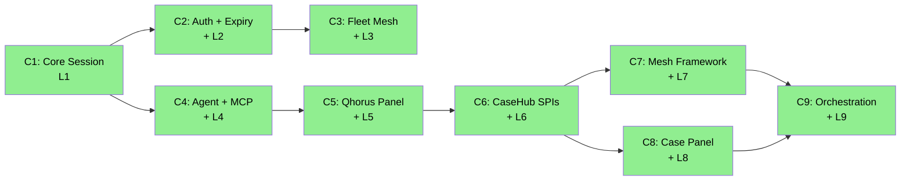

# claudony — ARC42STORIES.MD

**Spec:** Arc42Stories v0.1
**Profile:** CaseHub — Integration tier
**Profile ref:** `../parent/docs/arc42stories-casehub-profile.md` · fallback: `https://raw.githubusercontent.com/casehubio/parent/main/docs/arc42stories-casehub-profile.md`
**Build position:** After casehub-qhorus, casehub-engine SPIs, casehub-ledger, casehub-work. Integration layer — depends on most of the foundation stack.
**Consumed by:** Application-tier harness apps (via WorkerProvisioner SPI — provides Claude CLI sessions as CaseHub workers)
**Depends on:** casehub-qhorus (ChannelService, MessageService), casehub-engine SPIs (ReactiveWorkerProvisioner, WorkerExecutionManager, CaseChannelProvider, WorkerContextProvider, WorkerStatusListener, InstanceActorIdProvider), casehub-ledger (CaseLedgerEntry entity, LedgerPersistenceUnit), casehub-work (WorkItemService — optional)

---

## §1 Introduction and Goals

### Description

Claudony wires Claude Code CLI sessions into the CaseHub accountability framework. A single Quarkus binary operates in two modes: **Server** (manages tmux sessions, streams terminal output over WebSocket, serves the web dashboard and REST API) and **Agent** (local MCP endpoint for a controller Claude instance; proxies session commands to the Server via REST).

The integration layer has three jobs:

1. **Session persistence** — Claude Code sessions survive browser close, network outages, and JVM restart. tmux is the source of truth.
2. **SPI integration** — implements casehub-engine's worker SPIs to provision Claude CLI sessions as CaseHub workers, route case channels through Qhorus, and bridge worker identity to the audit ledger.
3. **Observation surface** — the unified dashboard provides a single browser view of all active sessions, case workers, and Qhorus channels across the fleet.

### Stakeholders

| Stakeholder | Interest |
|---|---|
| Developer / operator | Runs Claude Code sessions remotely; accesses them from any device via browser or PWA |
| Controller Claude | Uses MCP tools (8 session management + Qhorus tools) to create, read, and command sessions |
| Application-tier harness apps | Consume `ClaudonyReactiveWorkerProvisioner` SPI to provision real LLM agents |
| CaseHub platform team | Relies on SPI contracts and audit ledger entries for correctness and backward compatibility |
| AI agent (Claude session) | Receives structured system prompt with mesh channels, prior workers, and startup sequence |

### Quality Goals

| Priority | Goal | Scenario |
|---|---|---|
| 1 | Session durability | A Claude Code session running a multi-hour refactor survives server restart without data loss; `bootstrapRegistry()` re-registers it from tmux state on next startup |
| 2 | Terminal fidelity | On WebSocket reconnect, `tmux resize-window` delivers SIGWINCH before `capture-pane`, so TUI apps (Claude Code, vim) redraw into the live stream before the user sees garbled output |
| 3 | SPI isolation | `TmuxService`, `SessionRegistry`, and `TerminalWebSocket` carry zero CaseHub or Qhorus concepts; all coupling lives in `claudony-casehub` module SPI implementations |
| 4 | Audit completeness | Every worker action is traceable — `ClaudonyInstanceActorIdProvider` bridges Claude session identity to `claude:{roleName}@v1` actor IDs in the Qhorus ledger |

### Artifact Schema

| Artifact type | Format | Example | Where it lives |
|---|---|---|---|
| Issue | `#NNN` or `casehubio/claudony#NNN` | `#145` | GitHub Issues |
| ADR | `ADR-NNNN` | `ADR-0003` | `docs/adr/` |
| Garden entry | `GE-YYYYMMDD-XXXXXX` | `GE-20260601-b0eabf` | `~/.hortora/garden/` |
| Protocol | `PP-YYYYMMDD-XXXXXX` | `PP-20260620-cb7137` | `casehub/garden: docs/protocols/` |
| Design spec | `YYYY-MM-DD-topic-design` | `2026-04-27-claudony-agent-mesh-framework` | `docs/superpowers/specs/` |
| Blog entry | `YYYY-MM-DD-mdpNN-title` | `2026-04-24-mdp01-four-spis-two-traps` | workspace `blog/` |

---

## §2 Constraints

### Platform

| Constraint | Value |
|---|---|
| Java | 21 language level, running on JVM 26 |
| Framework | Quarkus 3.32.2 |
| Native image target | GraalVM 25; MCP transport uses HTTP (no stdio subprocess) for GraalVM compatibility |
| Build | `JAVA_HOME=$(/usr/libexec/java_home -v 26) mvn clean install` — use `mvn`, not `./mvnw` |
| Terminal | tmux required on the server host; no PTY available in JVM process |

### Architectural Constraints

- `TmuxService`, `SessionRegistry`, and `TerminalWebSocket` must stay clean of CaseHub/Qhorus concepts; SPI implementations are the only coupling point
- The named datasource `qhorus` isolates Qhorus schema from any future Claudony-owned schema — all Flyway migrations are Qhorus-managed
- HTTP JSON-RPC for MCP (`POST /mcp`) is non-negotiable — native image requires no stdio subprocess
- WebAuthn requires HTTPS; TLS is terminated by Caddy in production, not Quarkus
- `casehub-ledger`'s own CDI beans (`CaseLedgerEntryRepository`, `CaseLedgerEventCapture`) are excluded via `quarkus.arc.exclude-types` to avoid `LedgerEntryRepository` ambiguity; only `CaseLedgerEntry` (JPA entity) is used directly

---

## §3 Context and Scope



### Boundary Rules

Claudony owns:
- tmux session lifecycle and terminal streaming
- WebSocket/REST session API and web dashboard
- CaseHub SPI implementations (worker provisioning, channels, context, status)
- Qhorus observation layer (ClaudonyChannelBackend, ChannelEventBus, MeshResource)
- Fleet peer mesh and session federation
- MCP endpoint (session management + Qhorus tools)

Claudony does NOT own:
- Case orchestration logic (casehub-engine)
- Channel semantics and message routing (casehub-qhorus)
- Audit ledger Merkle chain (casehub-ledger)
- Domain-specific case definitions (application-tier harness apps)
- Agent selection or task routing (casehub-work, casehub-engine)

See `../parent/docs/PLATFORM.md` Capability Ownership table for the authoritative boundary map.
See `../parent/docs/repos/claudony.md` for the platform deep-dive.

---

## §4 Solution Strategy

### Core Architectural Patterns

- **Two-mode binary** — a single Quarkus binary with `claudony.mode=server|agent` conditional activation. Server owns sessions; Agent proxies via REST + exposes MCP.
- **tmux as external state store** — sessions exist independently of the JVM. On restart, `ServerStartup.bootstrapRegistry()` reads `tmux list-sessions`, recovering all sessions with the `claudony-` prefix and their CaseHub metadata from tmux session options (`@casehub_case_id`, `@casehub_role`).
- **Virtual threads throughout** — blocking I/O (tmux ProcessBuilder, FIFO reads, health checks) runs on virtual threads. REST endpoints are on the Quarkus default executor. Vert.x event loop is never blocked.
- **@DefaultBean CDI displacement** — SPI default beans (e.g., `EmptyCaseLineageQuery`) carry `@DefaultBean` and are displaced at deployment by `@Alternative @Priority(1)` implementations when the full engine stack is present.
- **SPI module isolation** — `claudony-casehub` holds all CaseHub/Qhorus coupling. `claudony-core` and the app's `server.*` packages are clean of external dependencies.

### Layer Taxonomy

| Layer | Concern |
|---|---|
| L1 Core Session Engine | tmux session lifecycle, SessionRegistry, TmuxService, WebSocket/FIFO streaming, REST /api/sessions, basic static frontend |
| L2 Auth + Session Lifecycle | WebAuthn passkey, API key, EncryptionKeyConfigSource, session expiry (ExpiryPolicy SPI), rate limiting, invite flow |
| L3 Fleet / Peer Mesh | PeerRegistry, peer discovery (static/manual/mDNS), session federation fan-out, fleet key auth, channel fleet sync |
| L4 Agent Mode + MCP | ClaudonyMcpTools (HTTP JSON-RPC), ServerClient, ClipboardChecker, ITerm2Adapter, two-mode binary activation |
| L5 Qhorus Integration | Named datasource (qhorus/H2/Flyway), ClaudonyChannelBackend, ChannelEventBus, MeshResource (channels/instances/timeline/feed/events SSE), human interjection |
| L6 CaseHub SPI Foundation | ClaudonyReactiveWorkerProvisioner, ClaudonyReactiveCaseChannelProvider, ClaudonyReactiveWorkerContextProvider, ClaudonyWorkerStatusListener, CaseLineageQuery, ClaudonyLedgerEventCapture, WorkerCommandResolver |
| L7 Agent Mesh Framework | WorkerSessionMapping (role↔instance identity bridge), ClaudonyInstanceActorIdProvider, MeshSystemPromptTemplate, CaseChannelLayout SPI, MeshParticipationStrategy SPI (both in engine-api) |
| L8 Case Worker Panel | Session.caseId/roleName (provision-time stamp), SessionRegistry.findByCaseId, CaseEventBroadcaster, CaseWorkerUpdateStrategy SPI, three-panel terminal UI, case-events SSE |
| L9 Production Case Orchestration | createWorkerSession (command-direct tmux, session dies on exit), ClaudonyWorkerExecutionManager (virtual thread watcher, atomic gate), AgentCase YAML definition, signal drain, CasehubStartupService crash recovery |

### Chapter Sequencing Rationale

Hard dependencies — order is non-negotiable:
- C1 before all: REST and SessionRegistry are the foundation everything else builds on
- C2 after C1: auth protects existing endpoints — nothing to protect without C1
- C3 after C1: federation proxies session REST — requires C1 sessions to exist
- C3 after C2: fleet endpoints use fleet-key auth (from C2's auth framework)
- C4 after C1: Agent mode proxies session REST — requires running Server with C1
- C5 after C4: Qhorus tools join the same MCP endpoint alongside C4's session tools
- C6 after C5: CaseHub SPIs write Qhorus channels and use the qhorus named datasource (C5)
- C7 after C6: identity bridge wraps the CaseHub worker model established in C6
- C8 after C6: case worker panel reads caseId/roleName stamped by C6's provisioner
- C9 after C7: signal drain uses identity bridge (roleName) from C7
- C9 after C8: CasehubStartupService crash recovery integrates with C8's panel restart path

---

## §5 Building Block View



### Module Index

| Maven module | Artifact | Contents |
|---|---|---|
| `claudony-core` | `claudony-core` | Session model (Session, SessionStatus, SessionExpiredEvent), TmuxService, SessionRegistry, ExpiryPolicy SPI + 3 implementations, ExpiryPolicyRegistry, SessionIdleScheduler, WorkerCaseLifecycleEvent CDI event |
| `claudony-casehub` | `claudony-casehub` | All CaseHub SPI implementations (L6+L7+L9), CaseLineageQuery SPI, MeshSystemPromptTemplate, WorkerSessionMapping, ClaudonyInstanceActorIdProvider, AgentCase |
| `claudony-app` | `claudony` (runnable) | Quarkus application; SessionResource, TerminalWebSocket, ServerStartup, auth/*, fleet/*, agent/*, MeshResource, ChannelEventBus, ClaudonyChannelBackend, CaseEventBroadcaster, strategy/*, EncryptionKeyConfigSource |

---

## §6 Runtime View

### Scenario 1 — Session creation and WebSocket terminal streaming

```
Client → POST /api/sessions → SessionResource.create()
  → TmuxService.createSession("claudony-<uuid>", workingDir, command)
       → tmux new-session -d -s claudony-<uuid> -c workingDir
  → SessionRegistry.add(session)
  → 201 Created { id, name, workingDir, status }

Browser → WS /ws/{id} → TerminalWebSocket.onOpen()
  → TmuxService.resizeWindow(cols, rows)   ← resize-window (detached-safe)
  → 150ms delay → TmuxService.captureHistory()
       → tmux capture-pane -e -p -S -100 → strip padding/leading/trailing blank rows
       → append ESC[row;colH cursor-position escape from tmux #{cursor_y} #{cursor_x}
  → send history to client synchronously
  → TmuxService.pipePaneToFifo(name, fifo)
       → tmux pipe-pane -o -t name "cat >> fifo"
  → Thread.ofVirtual().start( FIFO read loop → WebSocket send )
Browser keystroke → onMessage() → TmuxService.sendKeys(name, text)
       → tmux send-keys -t name -l "text"   ← literal mode (-l) required
```

**Key constraint:** `tmux resize-window` (not `resize-pane`) is used for detached sessions that have no attached client. Without the resize-before-capture sequence, TUI apps (Claude Code, vim) don't redraw and the captured history is wrong.

### Scenario 2 — Channel message delivery (Qhorus → SSE → browser)

```
Agent (Claude session) → POST /mcp → ClaudonyMcpTools → QhorusMcpTools.sendMessage()
  → messageService.send() (persist to qhorus PU)
  → ChannelGateway.fanOut(channelId, message)
  → ClaudonyChannelBackend.post(ref, message)  [virtual thread]
  → ChannelEventBus.emit(channelName)           [tick signal — channel-name keyed]

Browser EventSource → MeshResource.channelEvents() 500ms server tick
  → QhorusDashboardService.getTimeline(name, lastSentId, 50)
  → bare JSON string → RESTEasy Reactive wraps as "data: ...\n\n"
  → Browser EventSource.onmessage → appendMessages(entries)
  → chCursors[channelName] updated in sessionStorage

Fleet cross-node: message on Node B → FleetMessageRelayObserver.onMessage()
  → virtual thread per healthy peer → POST /api/internal/channels/notify {channelName} to Node A
  → ChannelSyncResource.notify() → ChannelEventBus.emit(channelName) on Node A
  → Node A SSE tick → browser fetches from shared PG QhorusDashboardService
```

### Scenario 3 — CaseHub worker provision

```
casehub-engine → ReactiveWorkerProvisioner.provision(context)
  → ClaudonyReactiveWorkerProvisioner.provision(context)
  → WorkerCommandResolver.resolve(context.capability()) → command string
  → TmuxService.createWorkerSession("claudony-worker-<uuid>", command, workingDir)
       → tmux new-session -d -s name "sh -c <command>" + remain-on-exit off
       → tmux set-option @casehub_case_id <caseId>
       → tmux set-option @casehub_role <roleName>
  → SessionRegistry.add(session with caseId + roleName)
  → WorkerSessionMapping.register(caseId, roleName, sessionId)
  → QhorusCausalLinkResolver.resolve(context) → causedByEntryId (if COMMAND/QUERY)
  → Uni.combine(openChannels, causalLink) → ProvisionResult
  → (parallel) ClaudonyWorkerExecutionManager.startWatcher(sessionId)
       → Thread.ofVirtual().start( poll tmux has-session every N ms )
```

### Scenario 4 — Worker exit and case completion

```
Claude CLI exits → tmux session closes
  → ClaudonyWorkerExecutionManager watcher: tmux has-session returns non-zero
  → pendingExitSignals.put(caseId, roleName)
  → registry.remove(sessionId) != null   ← atomic gate (whichever caller wins, publishes)
  → eventBus.send("casehub.worker.completed", WorkflowExecutionCompleted)

casehub-engine → WorkerExecutionCompletedHandler → ClaudonyLedgerEventCapture.observe(event)
  → em.persist(CaseLedgerEntry for WorkerExecutionCompleted)
  → em.flush()                                     ← ledger row must exist before signal
  → drainExitSignal(caseId) → roleName
  → CasehubRuntimeCompat.signal(caseId, "workers." + roleName + ".exited", true)
       → CaseHubRuntime.signal() → context["workers.researcher.exited"] = true
       → fires CONTEXT_CHANGED → engine evaluates goal "workers.researcher.exited == true"
       → CaseStatus → COMPLETED
```

**Ordering constraint:** `pendingExitSignals.put()` before `eventBus.send()`, `drainExitSignal()` after `em.flush()`. Documented in PP-20260617-52285f.

---

## §7 Deployment View

Published as JVM runnable jar from `claudony-app`. Native image (GraalVM 25) is supported via `mvn package -Pnative`. CI: GitHub Actions (`.github/workflows/publish.yml`). Docker image uses `eclipse-temurin:21-jre-alpine` + tmux.

```
[Caddy reverse proxy — TLS termination]
       ↓ HTTP/WS
[Claudony Server (port 7777)] ←──── REST ────→ [Claudony Agent (port 7778)]
       ↓                                                ↓
   [tmux sessions]                             [iTerm2 / terminal]
       ↓
[Named datasource: qhorus (H2 single-node / PostgreSQL multi-node)]
```

Fleet deployment: two or more nodes running `docker compose up` with `CLAUDONY_FLEET_KEY` env var and static peer config (`claudony.peers=http://mac-mini:7777`). Nodes federate session lists and relay channel events. Multi-node requires shared PostgreSQL for Qhorus — H2 is single-instance only.

---

## §8 Crosscutting Concepts

### Governing protocols

| Concern | Protocol / Reference |
|---|---|
| Module tier structure | `casehub/garden: docs/protocols/universal/module-tier-structure.md` |
| Named datasources | `../parent/docs/PLATFORM.md` §Persistence |
| CDI displacement (`@DefaultBean`) | `casehub/garden: docs/protocols/casehub/alternative-extension-patterns.md` |
| Capability ownership | `../parent/docs/PLATFORM.md` Capability Ownership table |
| Architectural patterns | `../parent/docs/ARCHITECTURE.md` |
| Event loop thread safety (`@WithSession`) | `PP-20260616-fc862e` |
| Signal drain ordering | `PP-20260617-52285f` |
| SPI caseId parameter | `casehub/garden: docs/protocols/casehub/spi-case-id-parameter.md` |

### Virtual threads and blocking I/O

Claudony uses blocking I/O throughout. Safety matrix:

| Context | Thread | Blocking I/O? |
|---|---|---|
| REST endpoints (`@Path`) | Quarkus default executor | ✅ Safe — not event loop |
| WebSocket `onOpen()` | WebSocket handler | ✅ Safe — short-lived |
| FIFO streaming | `Thread.ofVirtual().start()` | ✅ Safe — virtual thread owns read loop |
| Health checks | `Executors.newVirtualThreadPerTaskExecutor()` | ✅ Safe |
| `@WithSession` guards | Must be on event loop thread | `Context.isOnEventLoopThread()` guards required (PP-20260620-cb7137) |

**`@WithSession` rule:** Hibernate Reactive `@WithSession` requires an event loop thread. Use `Context.isOnEventLoopThread()` (not `isEventLoopContext()`) to guard — `executeBlocking` workers inherit parent event loop Context making `isEventLoopContext()` incorrectly return true. Fix: `if (Context.isOnEventLoopThread()) { ... } else { Uni.createFrom().item(...).emitOn(stableContext) }`.

### Anti-patterns

**1. `@ConfigMapping` properties triggering strict validation before library JAR registers**

> **Symptom:** `ConfigValidationException: SRCFG00050: claudony.casehub.enabled does not map to any root` on startup, even though the `@ConfigMapping` interface is on the classpath.
>
> **Cause:** SmallRye Config strict validation fires during config source loading, before library JAR config roots register. Properties with no registered root fail immediately.
>
> **Fix:** Do not add `@ConfigMapping` properties to `application.properties` until the library JAR is on the classpath. Users who want to configure the CaseHub module add properties themselves. Never ship default CaseHub properties in the base `application.properties`.

**2. JPA repository class that is not a CDI bean**

> **Symptom:** `UnsatisfiedResolutionException: Unsatisfied dependency for type CaseLedgerEntryRepository` at augmentation.
>
> **Cause:** `CaseLedgerEntryRepository` extends `JpaLedgerEntryRepository` and uses `@Inject EntityManager`, but carries no `@ApplicationScoped` annotation — it is not a CDI bean despite looking exactly like one.
>
> **Fix:** Introduce a single-method interface (`CaseLineageQuery`) with a `@DefaultBean` no-op implementation (`EmptyCaseLineageQuery`). The full JPA implementation (`JpaCaseLineageQuery`) is `@Alternative @Priority(1)` and activates when the CaseHub datasource is configured. Never inject framework repository types directly.

**3. tmux shell outlives command → exit watcher loops forever**

> **Symptom:** `ClaudonyWorkerExecutionManager` watcher polls `tmux has-session` indefinitely; engine case stays `WAITING` after Claude CLI exits.
>
> **Cause:** `createSession()` launches a shell, then sends the command via `send-keys`. The shell stays alive after the command exits. `has-session` sees the shell, not the command.
>
> **Fix:** `createWorkerSession()` uses `new-session ... "sh -c <command>"` with `remain-on-exit off`. The session closes when the command exits, regardless of `~/.tmux.conf`. Regular user sessions use `createSession()` unchanged — keeping the shell alive is correct behaviour there.

**4. `@Blocking` on plain CDI startup observer causes augmentation failure**

> **Symptom:** Quarkus augmentation fails with a classloader error reporting the wrong class, when `@Blocking` is added to a method called from a startup `@Observes` CDI event.
>
> **Cause:** `@Blocking` only applies in reactive dispatch contexts — JAX-RS, reactive messaging, event bus consumers. On a plain CDI bean method called from a startup observer, the annotation is not honoured and causes build-time processing to fail.
>
> **Fix:** Remove `@Blocking`. Startup observers run on the main thread — blocking calls there are safe without the annotation. If the method calls `.await().atMost()` on a `Uni`, it works correctly without `@Blocking` in the startup observer context.

**5. `@RegisterProvider` on REST client interface not guaranteed for programmatic builders**

> **Symptom:** Fleet key header (`X-Api-Key`) missing from outbound peer calls; circuit breakers open; all peers report 401 Unauthorized.
>
> **Cause:** `@RegisterProvider(FleetKeyClientFilter.class)` on the `PeerClient` interface is honoured for CDI-injected clients per MicroProfile spec, but `RestClientBuilder.newBuilder()` programmatic builders are implementation-defined — the filter may silently not run.
>
> **Fix:** Call `.register(FleetKeyClientFilter.class)` explicitly on every `RestClientBuilder` call site. GE reference: check garden for programmatic REST client filter registration.

---

## §9 Journeys and Chapters

### §9.1 Journey Overview

| Journey | Description | Chapters | Status |
|---|---|---|---|
| J1: Remote Terminal Access | Claude Code sessions that survive browser close, network outage, and server restart — accessible from any device | C1–C3 | ✅ Complete |
| J2: The MCP Agent | A controller Claude with MCP tools over the session layer and Qhorus mesh — the observer becomes a participant | C4–C5 | ✅ Complete |
| J3: CaseHub Integration | Claude sessions as CaseHub workers with full accountability — provision, observe, audit, complete | C6–C9 | ✅ Complete |



---

### §9.2 Chapter Index

| # | Chapter | Journey | Layers touched | Status |
|---|---|---|---|---|
| C1 | Core Session Engine | J1 | L1 | ✅ |
| C2 | Auth + Session Lifecycle | J1 | L2, L1 (low) | ✅ |
| C3 | Fleet / Peer Mesh | J1 | L3, L1 (low), L2 (low) | ✅ |
| C4 | Agent Mode + MCP | J2 | L4, L1 (low) | ✅ |
| C5 | Qhorus Integration + Mesh Panel | J2 | L5, L4 (low), L3 (low) | ✅ |
| C6 | CaseHub SPI Foundation | J3 | L6, L5 (low), L1 (low) | ✅ |
| C7 | Agent Mesh Framework + Identity Bridge | J3 | L7, L6 (medium), L5 (low) | ✅ |
| C8 | Case Worker Panel | J3 | L8, L6 (low), L1 (low) | ✅ |
| C9 | Production Case Orchestration | J3 | L9, L6 (medium), L8 (low), L1 (low) | ✅ |

**Layer × Chapter matrix**

| Layer | C1 | C2 | C3 | C4 | C5 | C6 | C7 | C8 | C9 |
|---|---|---|---|---|---|---|---|---|---|
| L1 Core Session Engine | High | Low | Low | — | — | — | — | Low | Low |
| L2 Auth + Session Lifecycle | — | High | Low | Low | — | — | — | — | — |
| L3 Fleet / Peer Mesh | — | — | High | — | Low | — | — | — | — |
| L4 Agent Mode + MCP | — | — | — | High | Low | Low | — | — | — |
| L5 Qhorus Integration | — | — | — | — | High | Low | Low | — | — |
| L6 CaseHub SPI Foundation | — | — | — | — | — | High | Medium | Low | Medium |
| L7 Agent Mesh Framework | — | — | — | — | — | — | High | Low | — |
| L8 Case Worker Panel | — | — | — | — | — | — | — | High | Low |
| L9 Production Orchestration | — | — | — | — | — | — | — | — | High |

**Sequencing rationale:**
- C1 before all: REST and SessionRegistry are the foundation everything else uses
- C2 after C1: auth protects existing endpoints — nothing to protect without C1
- C3 after C1+C2: federation requires sessions (C1) and fleet-key auth (C2)
- C4 after C1: Agent proxies session REST — requires running Server
- C5 after C4: Qhorus tools join the same MCP endpoint as C4's session tools; `qhorus` datasource co-configured
- C6 after C5: CaseHub SPIs write Qhorus channels and use the `qhorus` named datasource from C5
- C7 after C6: identity bridge wraps the CaseHub worker model established in C6
- C8 after C6: case worker panel reads `caseId`/`roleName` stamped by C6's provisioner
- C9 after C7: signal drain uses `roleName` from identity bridge (C7 `WorkerSessionMapping`)
- C9 after C8: `CasehubStartupService` crash recovery integrates with C8's bootstrap watcher path

---

### §9.3 Chapter Entries

#### Chapter 1 — Core Session Engine

**Journey:** J1 | **Sequence:** 1 of 9 | **Status:** ✅
**Delivered:** ~2026-03-15 | **Issues:** pre-issue-tracking | **Blog:** `blog/2026-04-13-mdp01-going-public.md`

**What this delivers**
A running Claudony server: Claude Code sessions launched as tmux processes, streamed over WebSocket with history replay on reconnect. Basic dashboard (session cards, status). REST API for session CRUD. Sessions survive browser close — `tmux` is the external state store, independent of JVM lifecycle.

**Accountability gaps closed**
- Session loss on browser close → tmux-as-external-state-store (sessions live independently of JVM)

**Layer Impact**
| Layer | Delta |
|---|---|
| L1 Core Session Engine | High — entire layer introduced |

---

#### Chapter 2 — Auth + Session Lifecycle

**Journey:** J1 | **Sequence:** 2 of 9 | **Status:** ✅
**Delivered:** 2026-04-21 | **Issues:** pre-#50 range | **Blog:** `blog/2026-04-21-mdp01-sessions-dont-last-forever.md`

**What this delivers**
WebAuthn passkeys (Touch ID / Face ID) plus API key for Agent→Server auth. Sessions survive server restarts (stable cookie encryption key via `EncryptionKeyConfigSource`). Three pluggable expiry policies distinguish idle shells from actively-working agents. Invite flow for multi-user onboarding. Rate limiting on auth paths.

**Accountability gaps closed**
- Unauthenticated access → WebAuthn passkey + API key dual mechanism (ADR-0003)
- Cookie invalidation on restart → EncryptionKeyConfigSource (256-bit key persisted to `~/.claudony/encryption-key`)
- Unbounded session accumulation → ExpiryPolicy SPI + SessionIdleScheduler

**Layer Impact**
| Layer | Delta |
|---|---|
| L2 Auth + Session Lifecycle | High — entire layer introduced |
| L1 Core Session Engine | Low — Session.expiryPolicy added; touch() bumped from REST and WebSocket |

---

#### Chapter 3 — Fleet / Peer Mesh

**Journey:** J1 | **Sequence:** 3 of 9 | **Status:** ✅
**Delivered:** 2026-04-15 | **Issues:** pre-#60 range | **Blog:** `blog/2026-04-15-mdp01-one-dashboard-all-sessions.md`

**What this delivers**
Multiple Claudony instances visible from one dashboard. Symmetric peer mesh (no master) — any node can see any other node's sessions. Circuit breaker with exponential backoff. Three discovery mechanisms. Fleet channel sync propagates Qhorus channel events cross-node. Docker image and docker-compose for two-node deployment.

**Accountability gaps closed**
- Single-instance visibility → symmetric peer mesh with session federation

**Layer Impact**
| Layer | Delta |
|---|---|
| L3 Fleet / Peer Mesh | High — entire layer introduced |
| L1 Core Session Engine | Low — SessionResource.list() gains `?local=true` federation guard |
| L2 Auth + Session Lifecycle | Low — FleetKeyService + FleetKeyClientFilter added for peer-to-peer auth |

---

#### Chapter 4 — Agent Mode + MCP

**Journey:** J2 | **Sequence:** 4 of 9 | **Status:** ✅
**Delivered:** ~2026-03-20 | **Issues:** pre-issue-tracking | **Blog:** `blog/2026-04-18-mdp01-phase-8-mesh-you-can-see.md` (references 8 session management tools as pre-existing)

**What this delivers**
`claudony.mode=agent` activates `POST /mcp` with 8 session management tools (JSON-RPC over HTTP — GraalVM-native compatible, no stdio subprocess). iTerm2 integration for co-located session launching. A controller Claude can now create, read, resize, and command any session via MCP.

**Accountability gaps closed**
- No programmatic session control → HTTP JSON-RPC MCP endpoint (ADR-0002)

**Layer Impact**
| Layer | Delta |
|---|---|
| L4 Agent Mode + MCP | High — entire layer introduced |
| L1 Core Session Engine | Low — ServerClient (typed REST client) added for Agent→Server proxying |

---

#### Chapter 5 — Qhorus Integration + Mesh Panel

**Journey:** J2 | **Sequence:** 5 of 9 | **Status:** ✅
**Delivered:** 2026-04-18, 2026-04-20 | **Issues:** pre-#80 range | **Blog:** `blog/2026-04-18-mdp01-phase-8-mesh-you-can-see.md`, `blog/2026-04-20-mdp01-speaking-into-the-mesh.md`

**What this delivers**
Qhorus embedded as Maven dependency. Named datasource `qhorus` (H2 file, Flyway-managed). Qhorus tools join the MCP endpoint. Dashboard Mesh panel (three views: Overview, Channel, Feed). Human interjection dock — humans post to any channel. `ClaudonyChannelBackend` hooks `ChannelGateway.fanOut()` into the in-process `ChannelEventBus` for SSE delivery.

**Accountability gaps closed**
- Agent communication invisible to operator → Mesh panel with real-time SSE delivery (ADR-0006, ADR-0007)

**Layer Impact**
| Layer | Delta |
|---|---|
| L5 Qhorus Integration | High — entire layer introduced |
| L4 Agent Mode + MCP | Low — Qhorus tools join existing `/mcp` endpoint |
| L3 Fleet / Peer Mesh | Low — ChannelFleetBroadcaster and FleetMessageRelayObserver added for cross-node channel sync |

---

#### Chapter 6 — CaseHub SPI Foundation

**Journey:** J3 | **Sequence:** 6 of 9 | **Status:** ✅
**Delivered:** 2026-04-24 | **Issues:** pre-#90 range | **Blog:** `blog/2026-04-24-mdp01-four-spis-two-traps.md`

**What this delivers**
All four casehub-engine worker SPIs implemented in `claudony-casehub`. `ClaudonyLedgerEventCapture` writes `CaseLedgerEntry` rows directly (replacing the excluded casehub-ledger CDI bean). The CaseHub module activatable via `claudony.casehub.enabled=true`. Engine can now orchestrate Claude sessions as CaseHub workers.

**Accountability gaps closed**
- No real LLM agents for CaseHub orchestration → ReactiveWorkerProvisioner SPI creates Claude CLI sessions on COMMAND dispatch

**Layer Impact**
| Layer | Delta |
|---|---|
| L6 CaseHub SPI Foundation | High — entire layer introduced |
| L5 Qhorus Integration | Low — `qhorus` PU shared for `JpaCaseLineageQuery` |
| L1 Core Session Engine | Low — Session.caseId + Session.roleName fields added |

---

#### Chapter 7 — Agent Mesh Framework + Identity Bridge

**Journey:** J3 | **Sequence:** 7 of 9 | **Status:** ✅
**Delivered:** 2026-04-27 | **Issues:** pre-#95 range; #159 (engine-api migration) | **Blog:** `blog/2026-04-27-mdp01-mesh-identity-normative.md`

**What this delivers**
`WorkerSessionMapping` bridges CaseHub role names and Claudony tmux session UUIDs. `ClaudonyInstanceActorIdProvider` maps sessions to `claude:{roleName}@v1` actor IDs in the audit ledger. `MeshSystemPromptTemplate` injects structured prompts (channels, startup sequence, prior workers) into agent context. `CaseChannelLayout` and `MeshParticipationStrategy` SPIs (engine-api) give application-tier control over channel topology and engagement mode.

**Accountability gaps closed**
- Anonymous agent actions → every Claude session has a stable, auditable `claude:{roleName}@v1` actor ID

**Layer Impact**
| Layer | Delta |
|---|---|
| L7 Agent Mesh Framework | High — entire layer introduced |
| L6 CaseHub SPI Foundation | Medium — WorkerContextProvider updated to stamp meshParticipation + systemPrompt |
| L5 Qhorus Integration | Low — deontic channel badge styling added to Mesh panel |

---

#### Chapter 8 — Case Worker Panel

**Journey:** J3 | **Sequence:** 8 of 9 | **Status:** ✅
**Delivered:** 2026-04-29 | **Issues:** #76, #77, #86 (partial), #104 | **Blog:** `blog/2026-04-29-mdp01-panel-knows-its-case.md`

**What this delivers**
Three-panel terminal layout (workers left, terminal centre, channels right). `Session.caseId`/`roleName` stamped at provision time. Click-to-switch reconnects WebSocket without page reload. `CaseEventBroadcaster` fans out `WorkerCaseLifecycleEvent` via SSE. `CaseWorkerUpdateStrategy` SPI (events-only / hybrid / registry-hooks) makes the update model pluggable. Case context panel: role, status, elapsed time, collapsible lineage.

**Accountability gaps closed**
- No cross-worker visibility from terminal → case worker panel with click-to-switch

**Layer Impact**
| Layer | Delta |
|---|---|
| L8 Case Worker Panel | High — entire layer introduced |
| L6 CaseHub SPI Foundation | Low — provisioner stamps caseId/roleName on Session |
| L1 Core Session Engine | Low — SessionRegistry.findByCaseId() + GET /api/sessions?caseId= filter |

---

#### Chapter 9 — Production Case Orchestration

**Journey:** J3 | **Sequence:** 9 of 9 | **Status:** ✅
**Delivered:** 2026-06-05, 2026-06-07 | **Issues:** #146, #148, #149, #150, #151 | **Blog:** `blog/2026-06-05-mdp01-the-shell-that-outlived-the-worker.md`, `blog/2026-06-07-mdp01-the-signal-that-writes.md`

**What this delivers**
Worker exit detected by `ClaudonyWorkerExecutionManager` (virtual thread polls `tmux has-session`). Case goal evaluation triggered via signal drain: `ClaudonyLedgerEventCapture` drains `pendingExitSignals` and calls `CaseHubRuntime.signal("workers.{role}.exited", true)` after `em.flush()`. `AgentCase` YAML definition with goal `workers.agent.exited == true`. `CasehubStartupService` restarts exit watchers on server restart. Cases now close automatically when Claude exits naturally.

**Accountability gaps closed**
- Engine never learned when a worker finished → worker exit watcher + signal drain closes the case lifecycle loop

**Layer Impact**
| Layer | Delta |
|---|---|
| L9 Production Orchestration | High — entire layer introduced |
| L6 CaseHub SPI Foundation | Medium — ClaudonyLedgerEventCapture gains signal drain; WorkerCommandResolver used by provisioner |
| L8 Case Worker Panel | Low — CasehubStartupService restarts watchers bootstrapped by panel's server restart path |
| L1 Core Session Engine | Low — createWorkerSession() added to TmuxService |

---

### §9.4 Layer Entries

#### Layer — L1: Core Session Engine

**Participates in chapters:** C1 (primary), C2, C3, C6, C8, C9
**Architectural patterns:** External state store (tmux), virtual thread per connection, FIFO-based streaming
**Key protocols:** pipe-pane streaming (ADR-0001), history replay ordering constraint
**Navigation:** `git log --grep="session\|tmux\|terminal" --oneline`
**Blog:** `blog/2026-04-13-mdp01-going-public.md`
**ADRs:** ADR-0001
**Completed:** 2026-03-15

#### What it adds
The terminal multiplexer as an external state store. Sessions outlive the JVM because they live in tmux. No PTY available from JVM — pipe-pane + named FIFO is the streaming mechanism. History replay is sent synchronously before pipe-pane starts, eliminating a race condition.

#### Key files

- `core/src/main/java/io/casehub/claudony/server/TmuxService.java` — all tmux ProcessBuilder wrappers; `createSession()` for user sessions; `createWorkerSession()` for CaseHub workers (direct command, `remain-on-exit off`); `pipePaneToFifo()`, `captureHistory()`, `sendKeys()`, `resizeWindow()`
- `core/src/main/java/io/casehub/claudony/server/SessionRegistry.java` — `ConcurrentHashMap`; `findByCaseId()` returns workers ordered by `createdAt`; `touch()` bumps `lastActive`
- `app/src/main/java/io/casehub/claudony/server/SessionResource.java` — REST `/api/sessions`; CRUD + resize + `?caseId=` filter + `GET /{id}/case-events` SSE
- `app/src/main/java/io/casehub/claudony/server/TerminalWebSocket.java` — WebSocket `/ws/{id}`; resize → capture → pipe sequence
- `app/src/main/java/io/casehub/claudony/server/ServerStartup.java` — `bootstrapRegistry()` from tmux list; `bootstrapChannelBackends()` re-registers `ClaudonyChannelBackend`

#### Key wiring
- `tmux resize-window` (not `resize-pane`) — works for detached sessions; delivers SIGWINCH so TUI apps redraw
- `tmux send-keys -t name -l "text"` — `-l` literal flag required; without it, special chars are tmux key bindings
- History replay: strip trailing-whitespace padding; preserve blank rows within content (removing shifts TUI cursor); append `ESC[row;colH` from `#{cursor_y} #{cursor_x}`
- `registry.remove()` must be inside try/catch in expiry scheduler — CDI synchronous events propagate exceptions; remove outside catch leaves registry inconsistent

#### Architectural decisions
tmux pipe-pane was chosen over PTY because JVM `ProcessBuilder` cannot provide a PTY. History replay sent synchronously before pipe-pane starts — sending after creates a race condition where live data arrives before replay completes.

#### Pattern introduced
`tmux-as-external-state-store`: sessions exist in tmux independently of JVM; state is always recoverable on restart.

#### Pattern anchor
`TmuxService.createSession()`, `TerminalWebSocket.onOpen()`, `ServerStartup.bootstrapRegistry()`

#### Gotchas
- **Symptom:** First char of live output appears before replay → **Cause:** pipe-pane started before `capture-pane` send → **Fix:** send replay first, then start pipe-pane (synchronous ordering)
- **Symptom:** TUI apps garbled on reconnect → **Cause:** `resize-pane` doesn't work detached; SIGWINCH not delivered → **Fix:** `resize-window` (server-side, works without attached client)
- **Symptom:** tmux "too many arguments" with no useful hint → **Cause:** tmux 3.6a strict arg order; `-t target -p format` works, reverse fails → **Fix:** always `-t` before `-p`

#### Pattern to replicate
1. Create sessions with namespaced prefix (`claudony-<uuid>`); filter by prefix on startup to recover
2. WebSocket onOpen: `resize-window` → 150ms wait → `capture-pane` → send synchronously → `pipe-pane`
3. For input: always `send-keys -l` literal flag
4. History: strip padding rows; preserve internal blank rows; append cursor-position escape

---

#### Layer — L2: Auth + Session Lifecycle

**Participates in chapters:** C2 (primary), C3 (fleet key extension)
**Architectural patterns:** MicroProfile ConfigSource for first-run secret generation, CDI `@Any Instance<T>` strategy discovery, sliding-window rate limiter
**Key protocols:** WebAuthn (quarkus-security-webauthn 3.32.2), MicroProfile Config
**Design refs:** `docs/superpowers/specs/2026-04-05-auth-design.md`
**Blog:** `blog/2026-04-21-mdp01-sessions-dont-last-forever.md`
**ADRs:** ADR-0003
**Completed:** 2026-04-21

#### What it adds
Two auth mechanisms with zero manual key setup. Cookie encryption key generated on first boot and persisted. Pluggable expiry policies distinguish idle shells from actively-working agents.

#### Key files

- `app/src/main/java/io/casehub/claudony/config/EncryptionKeyConfigSource.java` — MicroProfile `ConfigSource`; runs before CDI; generates 256-bit key; persists to `~/.claudony/encryption-key` (`chmod 600`)
- `app/src/main/java/io/casehub/claudony/server/auth/ApiKeyAuthMechanism.java` — `HttpAuthenticationMechanism`; reads `X-Api-Key` header
- `app/src/main/java/io/casehub/claudony/server/auth/ApiKeyService.java` — key resolution: config property → file → auto-generate; first-run banner
- `app/src/main/java/io/casehub/claudony/server/auth/CredentialStore.java` — `WebAuthnUserProvider`; atomic write `credentials.json`
- `app/src/main/java/io/casehub/claudony/server/auth/AuthRateLimiter.java` — sliding 5-min window, 10 attempts/IP; Vert.x route handler (covers `/q/webauthn/*` which bypass JAX-RS)
- `app/src/main/java/io/casehub/claudony/server/auth/InviteService.java` — UUID tokens, 24h TTL, consumed on first use
- `core/src/main/java/io/casehub/claudony/server/expiry/ExpiryPolicy.java` — SPI: `name()` + `shouldExpire(Session, TmuxService)`
- `core/src/main/java/io/casehub/claudony/server/expiry/ExpiryPolicyRegistry.java` — auto-discovered via `@Any Instance<ExpiryPolicy>`
- `core/src/main/java/io/casehub/claudony/server/expiry/SessionIdleScheduler.java` — `@Scheduled every 5m`

#### Key wiring
- `EncryptionKeyConfigSource` declared in `META-INF/services/org.eclipse.microprofile.config.spi.ConfigSource` — cannot use CDI injection, runs before CDI
- WebAuthn config keys: `quarkus.webauthn.relying-party.id`, `.relying-party.name`, `.origin` — exact SmallRye field names; `rp.id` and `origins` are silently ignored
- Rate limiter registered via Vert.x `@Observes Router` — covers WebAuthn ceremony paths that bypass JAX-RS `ContainerRequestFilter`
- `registry.remove()` must be inside try/catch in SessionIdleScheduler — CDI synchronous `fire()` propagates observer exceptions

#### Architectural decisions
WebAuthn over passwords — no secret to leak, Touch ID UX, iCloud Keychain multi-device sync. API key for Agent — simpler than session cookies for a headless agent. Rate limiter at Vert.x layer specifically to cover `/q/webauthn/*` which bypass JAX-RS entirely. ADR-0003.

#### Pattern introduced
`microprofile-configsource-first-run-secret`: `ConfigSource` (not CDI bean) for secrets that must be stable across restarts; persists to `~/.app/secret-file`.

#### Pattern anchor
`EncryptionKeyConfigSource.getValue()`, `ExpiryPolicyRegistry` constructor (auto-discovery)

#### Gotchas
- **Symptom:** Apple iCloud Keychain passkeys rejected at login → **Cause:** old `CredentialStore` called `UUID.fromString()` on AAGUID stored without dashes → **Fix:** Quarkus 3.32.2 upgrade rewrote `CredentialStore` against new webauthn4j API which handles this correctly
- **Symptom:** `registry.remove()` executes after expiry `fire()` throws → **Cause:** `remove()` outside try/catch → **Fix:** move inside try; atomic from error perspective

#### Pattern to replicate
1. `ConfigSource` (not CDI) for pre-CDI secrets; declare in `META-INF/services/`
2. `HttpAuthenticationMechanism` for custom auth schemes; multiple mechanisms tried in turn
3. `@Any Instance<ExpiryPolicy>` for auto-discovered strategies; no registration code
4. Rate limit at Vert.x router for extension-managed paths that bypass JAX-RS

---

#### Layer — L3: Fleet / Peer Mesh

**Participates in chapters:** C3 (primary), C5 (channel sync extension)
**Architectural patterns:** Symmetric peer mesh, circuit breaker with exponential backoff, atomic file persistence
**Blog:** `blog/2026-04-15-mdp01-one-dashboard-all-sessions.md`
**Completed:** 2026-04-15 (C3); channel fleet sync added in C5

#### What it adds
Symmetric multi-node mesh where any node can see any other's sessions. Circuit breaker prevents cascade failures. Fleet channel sync propagates Qhorus events cross-node for the shared dashboard.

#### Key files

- `app/src/main/java/io/casehub/claudony/server/fleet/PeerRegistry.java` — healthy peer list; circuit breaker (3 failures → open, exponential backoff 30s→5min); atomic `peers.json` write
- `app/src/main/java/io/casehub/claudony/server/fleet/PeerClient.java` — `@RegisterRestClient` for peer API calls
- `app/src/main/java/io/casehub/claudony/server/fleet/StaticConfigDiscovery.java` — loads `claudony.peers` at startup
- `app/src/main/java/io/casehub/claudony/server/fleet/ManualRegistrationDiscovery.java` — REST-triggered; exchanges peer lists on first contact; persists to `peers.json`
- `app/src/main/java/io/casehub/claudony/server/fleet/ChannelSyncResource.java` — POST `/api/internal/channels/sync` + `/notify` — fleet channel backend sync and SSE tick relay
- `app/src/main/java/io/casehub/claudony/server/fleet/ChannelFleetBroadcaster.java` — `@ObservesAsync CaseChannelCreatedEvent`; syncs new channel to all healthy peers
- `app/src/main/java/io/casehub/claudony/server/fleet/FleetMessageRelayObserver.java` — CLUSTER-scoped `MessageObserver`; relays channel-name tick to healthy peers on every Qhorus message dispatch
- `app/src/main/java/io/casehub/claudony/server/fleet/ProxyWebSocket.java` — WebSocket proxy for terminal sessions on peers behind NAT

#### Key wiring
- `GET /api/sessions?local=true` stops recursive federation — prevents exponential fan-out when peer A calls peer B
- `.register(FleetKeyClientFilter.class)` explicit on every `RestClientBuilder` call — `@RegisterProvider` on interface not guaranteed for programmatic builders (see anti-pattern §8.5)
- Stale peer sessions served from cache with `stale: true` — dashboard shows old data rather than error

#### Gotchas
- **Symptom:** Fleet key header missing from programmatic REST client → **Cause:** `@RegisterProvider` not spec-guaranteed for programmatic builders → **Fix:** explicit `.register()` on every `RestClientBuilder`
- **Symptom:** `PATCH /api/peers/{id}` returns `{"present":true,"empty":false}` → **Cause:** returned `Optional<PeerRecord>` directly from endpoint → **Fix:** unwrap Optional before returning

#### Pattern to replicate
1. Each `DiscoverySource` implementation feeds `PeerRegistry` independently
2. Circuit breaker at registry level; `healthyPeers()` callers need no circuit awareness
3. `?local=true` guard on all federated endpoints to prevent recursive fan-out
4. Channel sync: `@ObservesAsync CaseChannelCreatedEvent` to broadcast; CLUSTER-scoped `MessageObserver` to relay ticks

---

#### Layer — L4: Agent Mode + MCP

**Participates in chapters:** C4 (primary), C5 (Qhorus tools join)
**Architectural patterns:** Two-mode binary, HTTP JSON-RPC for MCP
**ADRs:** ADR-0002
**Blog:** implied in `blog/2026-04-18-mdp01-phase-8-mesh-you-can-see.md`
**Completed:** ~2026-03-20

#### What it adds
Same binary in `agent` mode exposes `POST /mcp`. 8 session management tools. GraalVM-native compatible (HTTP, no stdio subprocess). iTerm2 integration. Controller Claude can fully manage sessions without SSH.

#### Key files

- `app/src/main/java/io/casehub/claudony/agent/ClaudonyMcpTools.java` — 8 `@Tool` methods; structured error handling (serverError/connectError)
- `app/src/main/java/io/casehub/claudony/agent/ServerClient.java` — `@RegisterRestClient`; all MCP tools proxied to Server
- `app/src/main/java/io/casehub/claudony/agent/ApiKeyClientFilter.java` — injects `X-Api-Key` on all `ServerClient` calls
- `app/src/main/java/io/casehub/claudony/agent/terminal/ITerm2Adapter.java` — macOS AppleScript + `tmux -CC`
- `app/src/main/java/io/casehub/claudony/agent/terminal/TerminalAdapterFactory.java` — auto-detects: iterm2 (localhost) vs none
- `app/src/main/java/io/casehub/claudony/agent/AgentStartup.java` — startup check; warns and continues if Server unreachable

#### Key wiring
- `--mcp-config`: `mcpServers` wrapper key required — omitting produces silent schema validation failure
- `quarkus.mcp.server.tools.page-size=0` — disables 50-tool pagination cap; required when Qhorus tools (54) join endpoint
- Agent degrades gracefully if Server unreachable — warns prominently, starts anyway

#### Gotchas
- **Symptom:** MCP session creation silently fails → **Cause:** `mcpServers` wrapper missing → **Fix:** always `{"mcpServers": {...}}`
- **Symptom:** `IllegalArgumentException` from Qhorus tool not caught → **Cause:** `@WrapBusinessError` wraps to `ToolCallException` → **Fix:** catch `ToolCallException`, inspect `e.getCause()`

#### Pattern to replicate
1. Two-mode binary: conditional bean activation via build property
2. Structured MCP error: `serverError()` maps HTTP 4xx to actionable messages; `connectError()` for unreachable server
3. Graceful degraded mode: warn at startup, don't fail

---

#### Layer — L5: Qhorus Integration

**Participates in chapters:** C5 (primary), C6, C7
**Architectural patterns:** Named datasource isolation, lazy backend registration, HumanObserverChannelBackend SPI
**ADRs:** ADR-0006, ADR-0007
**Design refs:** `docs/superpowers/specs/2026-04-27-claudony-agent-mesh-framework.md`
**Blog:** `blog/2026-04-18-mdp01-phase-8-mesh-you-can-see.md`, `blog/2026-04-20-mdp01-speaking-into-the-mesh.md`
**Completed:** 2026-04-20; extended in C6/C7

#### What it adds
Qhorus embedded with isolated `qhorus` named datasource. `ClaudonyChannelBackend` hooks `ChannelGateway.fanOut()` into `ChannelEventBus` for SSE delivery. Mesh panel exposes channels, instances, timeline, feed. Human interjection. Lazy backend registration avoids circular CDI dependency between app and casehub modules.

#### Key files

- `app/src/main/java/io/casehub/claudony/server/ClaudonyChannelBackend.java` — `HumanObserverChannelBackend` SPI; singleton; `post()` → `ChannelEventBus.emit(channelName)`
- `app/src/main/java/io/casehub/claudony/server/ChannelEventBus.java` — in-process SSE tick fan-out; `subscribe(name)` → `Multi<Integer>`; `emit(name)` ticks subscribers
- `app/src/main/java/io/casehub/claudony/server/MeshResource.java` — REST `/api/mesh/*`; channels/instances/timeline/feed/events SSE/`POST /channels/{name}/messages`

#### Key wiring
- Backend registration is lazy (at first `EventSource` subscribe) — avoids circular dep; `bootstrapChannelBackends()` in `ServerStartup` re-registers on restart (ADR-0006)
- SSE: 500ms server tick; emit bare JSON string — RESTEasy wraps `data:` framing (ADR-0007)
- Named datasource: `quarkus.datasource.qhorus.*`, `quarkus.hibernate-orm.qhorus.datasource=qhorus`, `quarkus.flyway.qhorus.migrate-at-start=true`
- `casehub-ledger` CDI beans excluded via `quarkus.arc.exclude-types` — prevents `LedgerEntryRepository` ambiguity

#### Gotchas
- **Symptom:** SSE delivers `data: data: {...}` double-framed → **Cause:** manual `data:` prefix in emitted string → **Fix:** emit bare JSON; RESTEasy wraps automatically
- **Symptom:** Channel backend not receiving posts after restart → **Cause:** `ClaudonyChannelBackend` not re-registered → **Fix:** `bootstrapChannelBackends()` in `ServerStartup` (ADR-0006)

#### Pattern to replicate
1. Named datasource for external module schema; separate Flyway path
2. `HumanObserverChannelBackend` SPI: register lazily at first subscriber; re-register on restart
3. SSE: emit bare JSON strings; never add `data:` manually

---

#### Layer — L6: CaseHub SPI Foundation

**Participates in chapters:** C6 (primary), C7 (medium), C8 (low), C9 (medium)
**Architectural patterns:** @DefaultBean CDI displacement, reactive Uni composition, named persistence unit, CDI exclusion
**Key protocols:** `PP-20260616-fc862e` (reactive-panache event-loop), `PP-20260616-d32bc3` (causal context), `PP-20260620-cb7137` (isOnEventLoopThread)
**Blog:** `blog/2026-04-24-mdp01-four-spis-two-traps.md`
**Issues:** #94, #120, #135, #143, #144, #146
**Completed:** 2026-04-24 (foundation); extended through C9

#### What it adds
Four casehub-engine worker SPIs. `EmptyCaseLineageQuery` @DefaultBean keeps CDI satisfied without engine datasource. `ClaudonyLedgerEventCapture` writes `CaseLedgerEntry` rows directly with controlled sequencing guarantees. CaseHub module activatable via `claudony.casehub.enabled=true`.

#### Key files

- `casehub/src/main/java/io/casehub/claudony/casehub/ClaudonyReactiveWorkerProvisioner.java` — `ReactiveWorkerProvisioner` SPI; `createWorkerSession()`; stamps tmux options; returns `ProvisionResult`
- `casehub/src/main/java/io/casehub/claudony/casehub/ClaudonyReactiveCaseChannelProvider.java` — `CaseChannelProvider` SPI; init-on-first-touch; `CountDownLatch` race guard (#120); fires `CaseChannelCreatedEvent`
- `casehub/src/main/java/io/casehub/claudony/casehub/ClaudonyReactiveWorkerContextProvider.java` — `WorkerContextProvider` SPI; `Uni.combine()` parallel lineage + channels; `Context.isOnEventLoopThread()` guard on `@WithSession` paths
- `casehub/src/main/java/io/casehub/claudony/casehub/ClaudonyWorkerStatusListener.java` — `WorkerStatusListener` SPI; lifecycle → `SessionRegistry` status transitions
- `casehub/src/main/java/io/casehub/claudony/casehub/CaseLineageQuery.java` — SPI interface
- `casehub/src/main/java/io/casehub/claudony/casehub/EmptyCaseLineageQuery.java` — `@DefaultBean`; returns `Uni.createFrom().item(List.of())`
- `casehub/src/main/java/io/casehub/claudony/casehub/JpaCaseLineageQuery.java` — `@Alternative @Priority(1)`; queries `case_ledger_entry` via `@LedgerPersistenceUnit` EM
- `casehub/src/main/java/io/casehub/claudony/casehub/ClaudonyLedgerEventCapture.java` — `@ObservesAsync CaseLifecycleEvent`; writes `CaseLedgerEntry`; drains `pendingExitSignals` on `WorkerExecutionCompleted`
- `casehub/src/main/java/io/casehub/claudony/casehub/WorkerCommandResolver.java` — capability → command; default fallback
- `casehub/src/main/java/io/casehub/claudony/casehub/QhorusCausalLinkResolver.java` — extracts `correlationId` from COMMAND/QUERY; resolves to `CaseLedgerEntry` UUID

#### Key wiring
- `casehub-ledger` CDI beans excluded via `quarkus.arc.exclude-types` in production — `CaseLedgerEntry` JPA entity used directly
- `@WithSession` requires event loop thread; use `Context.isOnEventLoopThread()` guard (not `isEventLoopContext()` — executeBlocking workers inherit event loop Context)
- `@ConfigMapping` strict validation: never add `claudony.casehub.*` to base `application.properties` — see anti-pattern §8.1
- `CaseLineageQuery.findCompletedWorkers()` must be `@Blocking` when awaited in `SessionResource.getLineage()`

#### Gotchas
- **Symptom:** `ConfigValidationException: claudony.casehub.enabled does not map to any root` → see anti-pattern §8.1
- **Symptom:** `HR000068` Hibernate Reactive thread assertion on `@WithSession` → **Cause:** `isEventLoopContext()` incorrectly returns true for executeBlocking workers → **Fix:** `Context.isOnEventLoopThread()` guard (PP-20260620-cb7137)
- **Symptom:** Concurrent `openChannel()` creates duplicate channels → **Cause:** init-on-first-touch cache race window → **Fix:** `CountDownLatch` barrier (#120)

#### Pattern to replicate
1. SPI interface + `@DefaultBean` no-op + `@Alternative @Priority(1)` full impl
2. Exclude conflicting CDI beans via `quarkus.arc.exclude-types`
3. `Context.isOnEventLoopThread()` guard on `@WithSession` calls
4. `CountDownLatch` for concurrent init-on-first-touch cache entries

---

#### Layer — L7: Agent Mesh Framework

**Participates in chapters:** C7 (primary), C6 (medium)
**Architectural patterns:** Dual-identity bridge, deontic channel semantics, strategy SPI for mesh engagement
**Design refs:** `docs/superpowers/specs/2026-04-27-claudony-agent-mesh-framework.md`
**Blog:** `blog/2026-04-27-mdp01-mesh-identity-normative.md`
**Issues:** #86, #159
**Completed:** 2026-04-27; engine-api migration 2026-06-17 (#159)

#### What it adds
Two identity systems bridged by `WorkerSessionMapping`. Stable `claude:{roleName}@v1` actor IDs in the Qhorus ledger. Structured system prompts (channels, startup sequence, prior workers) injected into agent context. Configurable channel topology (normative/simple) and engagement mode (active/reactive/silent).

#### Key files

- `casehub/src/main/java/io/casehub/claudony/casehub/WorkerSessionMapping.java` — three maps: `caseId:role→sessionId`, `role→sessionId` (fallback), `sessionId→roleName` (reverse)
- `casehub/src/main/java/io/casehub/claudony/casehub/ClaudonyInstanceActorIdProvider.java` — `@Alternative @Priority(1)`; strips `claudony-worker-` prefix; returns `claude:{roleName}@v1`
- `casehub/src/main/java/io/casehub/claudony/casehub/MeshSystemPromptTemplate.java` — package-private; ACTIVE (full: role, channels, startup, prior workers), REACTIVE (reduced), SILENT (empty)
- `CaseChannelLayout` SPI in `casehub-engine-api` — `NormativeChannelLayout` (work/observe/oversight), `SimpleLayout` (work/observe)
- `MeshParticipationStrategy` SPI in `casehub-engine-api` — ACTIVE/REACTIVE/SILENT; `named(config)` factory method

#### Key wiring
- `WorkerSessionMapping` re-registration cleans stale reverse entry; same-role workers across different cases use precise `caseId:role→sessionId` lookup when engine provides caseId — fallback `role→sessionId` map retained for callers without caseId (fixed in #93, commit db61484)
- `CaseChannelLayout.named(config.channelLayout())` factory method post-#159 migration
- `WorkerContext.properties["systemPrompt"]` present for ACTIVE/REACTIVE only; SILENT and early-exit paths receive no prompt

#### Gotchas
- **Symptom:** Engine `WorkResultSubmitter.complete()` throws `IllegalArgumentException` — worker not found → **Cause:** UUID as worker name; engine looks up by role name → **Fix:** use `context.taskType()` as worker name
- **Symptom (historical):** Same-role workers across cases shared one `role→sessionId` entry → **Cause:** fallback map keyed by role only → **Fix:** resolved in #93 (db61484) — `onWorkerCompleted()` now uses precise `caseId:role` lookup

#### Pattern to replicate
1. Dual-identity bridge: `caseId:role→instance` (precise) + `role→instance` (fallback) + `instance→role` (reverse)
2. `InstanceActorIdProvider` @Alternative @Priority(1): strips internal prefix, returns human-readable actor ID, falls back to raw ID for terminated sessions
3. System prompt from: channel layout (channels) + participation strategy (mode) + lineage query (prior workers)

---

#### Layer — L8: Case Worker Panel

**Participates in chapters:** C8 (primary), C9 (low)
**Architectural patterns:** CDI pluggable strategy (CaseWorkerUpdateStrategy), SSE fan-out, three-panel terminal layout
**Issues:** #76, #77, #86 (partial), #104
**Blog:** `blog/2026-04-29-mdp01-panel-knows-its-case.md`
**Completed:** 2026-04-29

#### What it adds
Three-panel terminal view. `Session.caseId`/`roleName` stamped at provision time. `SessionRegistry.findByCaseId()`. Click-to-switch WebSocket. `CaseEventBroadcaster` SSE fan-out. `CaseWorkerUpdateStrategy` SPI (events-only / hybrid / registry-hooks). Case context panel: role, status, elapsed, lineage.

#### Key files

- `app/src/main/java/io/casehub/claudony/server/CaseEventBroadcaster.java` — `@ObservesAsync WorkerCaseLifecycleEvent`; SSE fan-out keyed by caseId
- `app/src/main/java/io/casehub/claudony/server/CaseWorkerUpdateStrategy.java` — SPI; `@DefaultBean` is HybridStrategy
- `app/src/main/java/io/casehub/claudony/server/strategy/HybridStrategy.java` — events + configurable heartbeat (default 30s)
- `app/src/main/java/io/casehub/claudony/server/strategy/EventsOnlyStrategy.java` — emits on `WorkerCaseLifecycleEvent` only
- `app/src/main/java/io/casehub/claudony/server/strategy/RegistryHooksStrategy.java` — fires on any `SessionRegistry` mutation
- `app/src/main/java/io/casehub/claudony/server/CasehubStartupService.java` — iterates registry on startup; restarts exit watchers for in-flight CaseHub sessions

#### Key wiring
- `GET /api/sessions/{id}/case-events` — SSE; `CaseEventBroadcaster.subscribe(caseId)` → `Multi<String>`
- Left panel `setInterval` (worker polling) cleared on close + `beforeunload` — prevents memory leak
- `history.replaceState()` updates URL on worker switch without page reload
- `GET /api/sessions?caseId=` short-circuits federation (`local=true`) — case workers are always local

#### Gotchas
- **Symptom:** Browser tests fail intermittently with connection refused → **Cause:** `BASE_URL` hardcoded as `http://localhost:8081`; `quarkus.http.test-port=0` assigns random port → **Fix:** `ConfigProvider.getConfig().getValue("test.url", String.class)` in `@BeforeAll`

#### Pattern to replicate
1. Stamp domain entity with case/role at creation time; never derive later
2. `CaseWorkerUpdateStrategy` SPI; `@DefaultBean` HybridStrategy covers 95% of cases
3. SSE fan-out: subscriber map keyed by caseId; `@ObservesAsync WorkerCaseLifecycleEvent` triggers broadcast
4. Three-panel layout: centre terminal is self-contained; left/right panels are additive

---

#### Layer — L9: Production Case Orchestration

**Participates in chapters:** C9 (primary)
**Architectural patterns:** Atomic compare-and-remove gate, signal-drain-after-flush ordering, virtual thread watcher
**Key protocols:** `PP-20260617-52285f` (signal drain ordering)
**Blog:** `blog/2026-06-05-mdp01-the-shell-that-outlived-the-worker.md`, `blog/2026-06-07-mdp01-the-signal-that-writes.md`
**Issues:** #146, #148, #149, #150, #151
**Completed:** 2026-06-07

#### What it adds
Worker exit detected by virtual thread watcher. Case goal evaluation triggered by signal drain. `AgentCase` YAML definition. `CasehubStartupService` crash recovery. Cases close automatically when Claude exits naturally — zero Claude-side changes required.

#### Key files

- `casehub/src/main/java/io/casehub/claudony/casehub/ClaudonyWorkerExecutionManager.java` — `WorkerExecutionManager` SPI; virtual thread watcher; atomic `registry.remove()` gate; `pendingExitSignals`; `drainExitSignal(UUID)`
- `casehub/src/main/java/io/casehub/claudony/casehub/AgentCase.java` — `YamlCaseHub`; loads `casehub/agent.yaml`; goal `workers.agent.exited == true`
- `core/src/main/java/io/casehub/claudony/server/TmuxService.java` (`createWorkerSession()`) — direct command, `remain-on-exit off`
- `app/src/main/java/io/casehub/claudony/server/CasehubStartupService.java` — reads tmux options on startup; restarts watchers for in-flight workers

#### Key wiring
- `createWorkerSession()` vs `createSession()`: worker sessions close when command exits; user sessions keep shell alive
- Ordering: `pendingExitSignals.put()` before `eventBus.send()`; `drainExitSignal()` after `em.flush()` (PP-20260617-52285f)
- Atomic gate: `registry.remove(sessionId) != null` — winner publishes `WorkflowExecutionCompleted`; `terminate()` removes from registry before killing session
- `@Blocking` must NOT be added to `CasehubStartupService` methods called from startup observers — see anti-pattern §8.4
- `CasehubRuntimeCompat` shim handles `CaseHubRuntime.signal()` return type skew across SNAPSHOT versions (void → CompletionStage<Void>)

#### Gotchas
- **Symptom:** Case stays `WAITING` after Claude exits → **Cause:** shell outlives command; watcher sees shell not command → **Fix:** `createWorkerSession()` with `sh -c <command>` and `remain-on-exit off`
- **Symptom:** `WorkflowExecutionCompleted` published twice → **Cause:** watcher and `terminate()` race → **Fix:** `registry.remove() != null` atomic gate; `terminate()` removes before kill
- **Symptom:** `@Blocking` on startup observer causes augmentation failure → see anti-pattern §8.4
- **Symptom:** Case goal satisfied, case stays `RUNNING` in tests → **Cause:** `CaseStatusChangedHandler` excluded from test profile → **Fix:** include handler in `CasehubEnabledProfile` active beans

#### Pattern to replicate
1. `createWorkerSession(command)` — direct command; `remain-on-exit off`; never shell wrapper for worker sessions
2. Virtual thread watcher: poll `tmux has-session`; exponential back-off or fixed interval
3. Atomic gate: `registry.remove()` as publish token
4. Signal drain: `pendingSignals.put()` before publish; drain after `em.flush()` in observer
5. Crash recovery: read metadata from external state (tmux options); restart watchers on server start


---

## §10 Architectural Decisions

Per spec: only decisions not captured inline elsewhere. Layer and Chapter entries hold the per-layer decisions; cross-cutting decisions live here.

### 2026-06-17 · CaseChannelLayout + MeshParticipationStrategy extracted to engine-api (#159, parent#93)

`CaseChannelLayout`, `NormativeChannelLayout`, `SimpleLayout`, `MeshParticipationStrategy`, and the three participation strategy implementations were extracted from `claudony-casehub` to `io.casehub.api.spi.mesh` in `casehub-engine-api`. Claudony was the wrong owner — `openclaw` had independently duplicated `NormativeChannelLayout` as `OpenClawNormativeLayout` before the extraction, confirming these are platform primitives used by any agent implementation.

Claudony now imports via `CaseChannelLayout.named(config.channelLayout())` and `MeshParticipationStrategy.named(config.meshParticipation())` factory methods.

Also fixed in this refactor: `strategyFor(String workerId, UUID caseId)` signature corrected from `strategyFor(String workerId, WorkerContext context)` — context was always null at the call site (DESIGN.md Outstanding, line 540). caseId is now passed directly per `spi-case-id-parameter.md` protocol.

*Commit: 7be4f61 — refactor(#159)*

### 2026-04-xx · Two-mode binary over two separate binaries

`claudony.mode=server|agent` conditional activation in a single Quarkus binary. Alternatives: two separate binaries (doubles build/deploy surface; version drift risk), CLI verbs (`claudony server` / `claudony agent` — planned but not yet implemented). The current binary-with-mode approach has zero deployment complexity overhead for the primary Mac Mini + MacBook use case.

### 2026-04-xx · Bioluminescent colony visual identity

Named `claudony` (Claude + colony metaphor). Visual language: void-black, violet/green/magenta, organic SVG nodes — distinct from QuarkMind's hex-grid/cyan aesthetic. The colony metaphor maps to the architecture: sessions as organisms, controller as coordinator, fleet as the colony. Rejected: `RemoteCC` (description not name), Deep Space Colony (too close to QuarkMind).

---

## §11 Quality Requirements

| Priority | Requirement | Scenario | Test coverage |
|---|---|---|---|
| 1 | Session durability | tmux session running multi-hour refactor survives JVM restart; `bootstrapRegistry()` recovers all sessions from tmux list on next startup | `ServerStartup.bootstrapRegistry()` package-private method tested directly |
| 2 | Terminal fidelity | TUI apps (Claude Code, vim) display correctly on WebSocket reconnect; cursor position restored; no garbled output | `SmokeTest`, `TerminalPageE2ETest` |
| 3 | SPI isolation | `TmuxService`, `SessionRegistry`, `TerminalWebSocket` carry zero CaseHub/Qhorus imports; all coupling in `claudony-casehub` | IntelliJ module dependency graph; no CaseHub imports in core/* packages |
| 4 | Audit completeness | Every worker action traceable to `claude:{roleName}@v1` actor ID in Qhorus ledger; `ClaudonyInstanceActorIdProvider` always resolves or falls back to raw ID | `ClaudonyWorkerStatusListenerTest`, `ClaudonyReactiveWorkerContextProviderTest` |
| 5 | Auth resilience | WebAuthn passkey + API key dual mechanism; both tried on every request; neither is a single point of failure | `AuthResource` tests, `ApiKeyAuthMechanism` tests |
| 6 | Test completeness | 587 tests, all green (as of 2026-06-20); no known failures | `mvn test` baseline in CLAUDE.md |

---

## §12 Risks and Technical Debt

### Active Risks

| Risk | Severity | Mitigation |
|---|---|---|
| Engine crash + server restart leaves orphaned workers | Medium | `CasehubStartupService` recovers watchers if engine is running; if engine has also restarted, session stays orphaned until next case provision — accepted limitation |
| Shared H2 `qhorus` datasource is single-instance | High for multi-node | Fleet channel sync requires shared PostgreSQL; H2 is documented as single-node only; postgres URL swap is the migration path |
| `SignalReceivedEventHandler` must remain active in `CasehubEnabledProfile` | Low | Excluding it causes `(NO_HANDLERS,-1) No handlers for address casehub.signal.received`; signals silently dropped; provision loops — covered by protocol PP-20260617-52285f |

### Technical Debt

| Item | Issue | Notes |
|---|---|---|
| `ClaudonyMcpTools` dispatch hardcoded tool set (#105) | Medium | Must become CDI composable (`Instance<McpToolProvider>`) before additional tool sources (e.g. domain-specific tools) can be added cleanly; tracked in open #105 |
| `MdnsDiscovery` scaffolded but not fully wired | Low | Advertise/discover works at mDNS level; full mesh integration deferred; static config and manual registration cover all current use cases |
| Multi-tenancy enforcement (#121) | Medium | `tenancyId` propagation implemented in `ClaudonyLedgerEventCapture` and event observers; full enforcement throughout open in #121 |
| Shared-data keys from prior workers not in mesh prompt | Low | Qhorus shared data context not yet included in `MeshSystemPromptTemplate`; tracked under epic #86; requires additional Qhorus integration |
| xterm.js theming | Low | Configurable presets (Nord, Solarized, Dracula) not yet implemented; colony palette is fixed; tracked in DESIGN.md Next Steps |
| Dashboard redesign | Low | Colony theme (void-black, violet/green/magenta) applied to landing page; not yet applied to session cards and dashboard chrome |
| `CasehubRuntimeCompat` reflection shim | Low | Handles `CaseHubRuntime.signal()` return type skew across SNAPSHOT versions; remove once engine API stabilises on a single signature |

---

## §13 Glossary

| Term | Definition |
|---|---|
| `TmuxService` | Wraps all `tmux` ProcessBuilder calls; source-of-truth interface for session lifecycle; intentionally clean of CaseHub/Qhorus concepts |
| `SessionRegistry` | In-memory `ConcurrentHashMap` of active sessions; `findByCaseId()` returns workers ordered by provisioning time; `touch()` bumps `lastActive` |
| `ReactiveWorkerProvisioner` | casehub-engine SPI implemented by `ClaudonyReactiveWorkerProvisioner` — provisions Claude CLI sessions as CaseHub workers on COMMAND dispatch |
| `CaseChannelLayout` | SPI (in casehub-engine-api) defining which channels open when a case starts; `NormativeChannelLayout` (work/observe/oversight) is the default |
| `MeshParticipationStrategy` | SPI (in casehub-engine-api) defining how a worker engages with the Qhorus mesh at startup; ACTIVE/REACTIVE/SILENT |
| `WorkerSessionMapping` | Bridges CaseHub role names to Claudony tmux session UUIDs — dual-identity bridge; three maps: `caseId:role→sessionId`, `role→sessionId` (fallback), `sessionId→roleName` (reverse) |
| `ClaudonyInstanceActorIdProvider` | `InstanceActorIdProvider` SPI (`@Alternative @Priority(1)`); maps `claudony-worker-{uuid}` → `claude:{roleName}@v1` for Qhorus ledger entries |
| `ClaudonyLedgerEventCapture` | Replaces excluded casehub-ledger `CaseLedgerEventCapture`; writes `CaseLedgerEntry` rows directly via `@LedgerPersistenceUnit` EM; drains `pendingExitSignals` on `WorkerExecutionCompleted` to fire case completion signal |
| `ClaudonyWorkerExecutionManager` | `WorkerExecutionManager` SPI; virtual thread watcher per worker session; atomic `registry.remove()` gate for publish-once guarantee |
| `AgentCase` | Production CaseHub case definition (`YamlCaseHub`); loads `casehub/agent.yaml`; goal condition `workers.agent.exited == true` (set by signal drain on session exit) |
| `ChannelEventBus` | In-process SSE tick fan-out keyed by channel name; `ClaudonyChannelBackend.post()` emits a tick; `MeshResource.channelEvents()` 500ms timer polls timeline |
| `CaseWorkerUpdateStrategy` | SPI for case worker panel update model; `@DefaultBean` is HybridStrategy (events + 30s heartbeat) |
| Signal drain | Pattern: `pendingExitSignals.put(caseId, roleName)` before `eventBus.send()`; drain and fire `CaseHubRuntime.signal("workers.{role}.exited", true)` after `em.flush()` in `ClaudonyLedgerEventCapture` |
| Integration tier | Claudony's position in the CaseHub ecosystem — after casehub-qhorus, casehub-engine, casehub-ledger; before application-tier harness apps (devtown, clinical, etc.) |
| Fleet | Multiple Claudony instances federated via symmetric peer mesh; session lists federated; Qhorus channel events relayed cross-node |
| `qhorus` datasource | Named Quarkus datasource (`quarkus.datasource.qhorus.*`) hosting Qhorus channels, messages, and casehub-ledger entries; H2 for single-node, PostgreSQL for fleet |
| Deontic channel semantics | Channel message types reflect normative footprint: QUERY (creates obligation to inform), COMMAND (creates obligation to execute), RESPONSE/DONE (discharge obligations), EVENT (no deontic footprint — pure telemetry) |

---

*Document generated 2026-06-23. Source material: `docs/DESIGN.md`, `docs/adr/`, `blog/` entries 2026-04-13 through 2026-06-17. Quality gate (PP-20260601-arc42stories-post-generation): all class names verified against `find . -name "*.java" -path "*/main/*"`; §12 issue references verified via `gh issue view`.*
